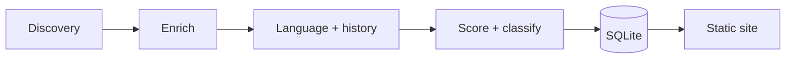

# ReRust

**Detect open-source projects being rewritten in Rust.**

ReRust scans GitHub for projects migrating to Rust, classifies each hit as a
**rewrite** (same shipping product moved to Rust) or a **replacement** (a new
Rust tool competing with an external one), scores confidence, and publishes a
static site from SQLite.

It is designed to run cheaply: a single binary on a schedule writes `rerust.db`
and regenerates `docs/` for GitHub Pages.

## Taxonomy

| Kind | Meaning | Examples |
|------|---------|----------|
| **Rewrite** | Same product that previously shipped in another language, migrated to Rust | Bun, uutils/coreutils, Astro compiler |
| **Replacement** | New Rust tool / third-party port competing with an external project | ripgrep, RuAnnoy |
| **Neither** | Noise (tutorials, wishlist memes, API shims) — dropped from the store | — |

Classification uses identity continuity (product name overlap) plus migration
evidence (rising-Rust commit history, in-place wording, real displaced language).
Issue/PR discovery alone does not grant rewrite status.

## Pipeline

1. **Discovery** — GitHub Search over repos and issues/PRs for rewrite/port signals.
2. **Enrichment** — stars, description, language byte breakdown.
3. **Language analysis** — Rust share + inferred original language.
4. **History (optional)** — clone + `git log --numstat` to detect rising-Rust transitions.
5. **Score + classify** — confidence in `[0, 1]` and `rewrite` / `replacement` / `neither`.
6. **Site** — render `docs/index.html` + `docs/data.json`.



## Usage

Production scans and enrichment run on **GitHub Actions** (see [Deployment](#deployment)).
For local development:

```bash
cargo build --release

export GITHUB_TOKEN="$(gh auth token)"   # recommended
./target/release/rerust scan --no-analyze-history   # fast discovery
./target/release/rerust backfill-history            # fault-tolerant history pass
./target/release/rerust reclassify                  # apply classifier changes offline
./target/release/rerust build-site --out docs

python3 -m http.server -d docs 8000
```

Optional local enrichment watchdog (dev only; not the production path):

```bash
./scripts/backfill-watch.sh          # daemonized exemplar scan + backfill loop
./scripts/backfill-watch.sh --foreground
```

### Commands

| Command | Description |
|---------|-------------|
| `scan` | Discover, analyze, score, and store candidates. |
| `reclassify` | Re-derive kind/confidence from stored rows (no network). Drops `neither`. |
| `backfill-history` | Resume-safe history enrichment for rows missing transition metrics. |
| `history <repo>` | Debug: print transition analysis for one repo. |
| `build-site` | Render stored results into a static site. |

Global flag: `--db <path>` (default `rerust.db`).

Useful `scan` flags: `--repo-pages`, `--issue-pages`, `--max-candidates`,
`--min-confidence`, `--no-analyze-history` (skip git walks during scan),
`--measure-unsafe` (opt-in cargo-geiger).

Useful `backfill-history` flags: `--max-stars` (default 25000), `--timeout-secs`
(per git step; overall budget is 3×), `--max-attempts` (dead-letter after N
failures), `--retry-failed`.

Backfill is fault-tolerant: per-repo failures are recorded, orphaned `git`
children are killed on timeout, a lock file prevents concurrent runs, and
restarts skip completed / dead-lettered rows.

### Rate limits

Authenticated Search API ≈ 30 req/min. Set `GITHUB_TOKEN` (or use Actions'
`secrets.GITHUB_TOKEN`).

## Deployment

Two scheduled workflows publish to GitHub Pages (source: **GitHub Actions** in
repo settings):

| Workflow | Schedule | Role |
|----------|----------|------|
| [`scan.yml`](.github/workflows/scan.yml) | Daily 06:00 UTC | Fast discovery scan (`--no-analyze-history`), reclassify, deploy |
| [`enrich.yml`](.github/workflows/enrich.yml) | Weekly Sun 08:00 UTC | Deep enrichment: parallel exemplar macro analysis + batched `backfill-history` (unsafe measurement on by default), reclassify, deploy |

Both use `${{ secrets.GITHUB_TOKEN }}` for GitHub API rate limits and cache
`rerust.db` between runs. Trigger either workflow manually from the Actions tab
(`workflow_dispatch`).

Local `scripts/backfill-watch.sh` mirrors the weekly enrichment loop for
development; production data processing should rely on `enrich.yml`.

## License

MIT
